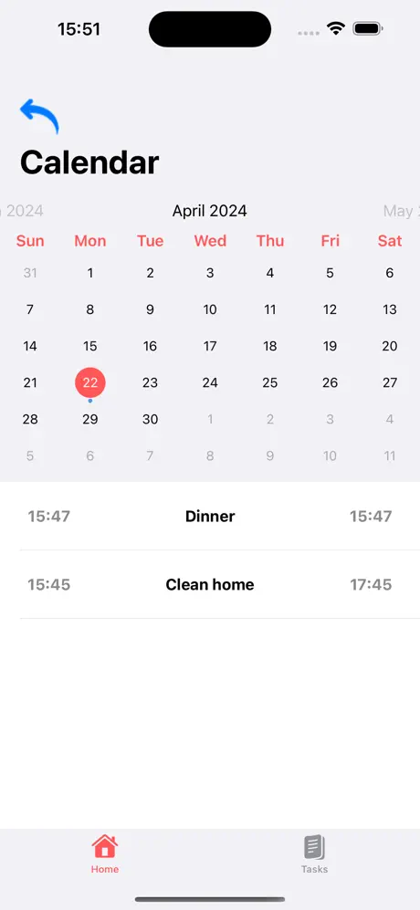
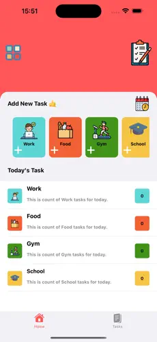
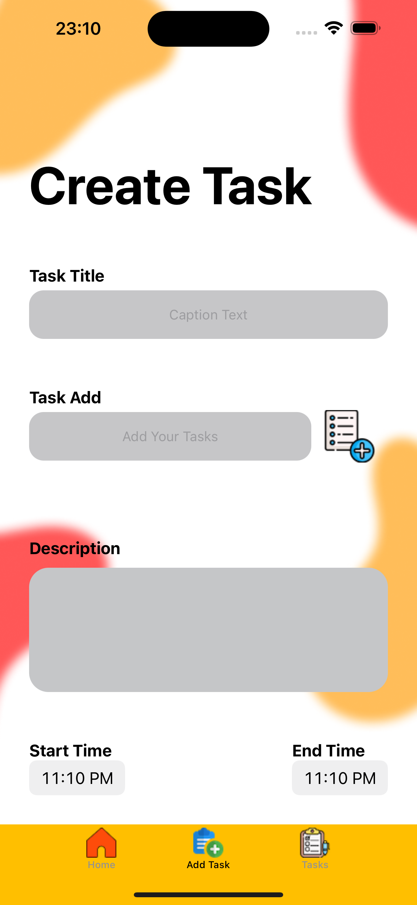
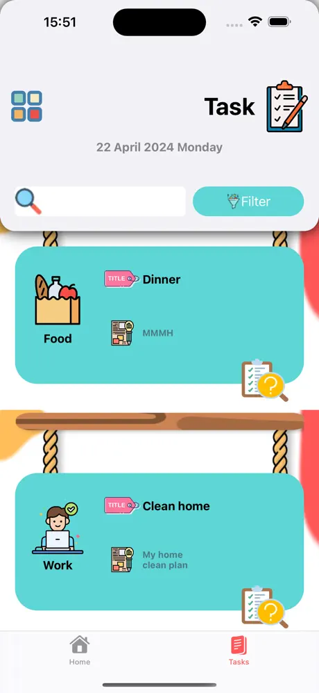

## Projects

### Balık Avı - İstanbul Balık Avı

#### Description
**Balık Avı - İstanbul Balık Avı** is an app designed for fishing enthusiasts in Istanbul. It allows users to calculate fishing probabilities based on real-time data such as weather and water temperature. Users can also identify their caught fish using AI and track their fishing activities over time with detailed progress charts.

#### Technologies Used
- 📊 Swift Charts
- 🔁 REST APIs
- 🎛️ UIKit
- 📍 CoreLocation
- 🗺️ MapKit

  
  

---

### Baraj24

  
  
  

#### Description
**Baraj24** provides real-time information on Turkey’s dam occupancy rates using open-source data. This app gives users insights into water levels, droughts, and potential water crises by showing historical and current reservoir data, helping raise awareness of future environmental challenges like droughts.

#### Technologies Used
- 📊 Swift Charts
- 🔁 REST APIs
- 🎛️ UIKit
- 🫛 CocoaPods
- 📍 CoreLocation
- 🗺️ MapKit

  
  

---

### TO-DO-APP

  
  
  
  

#### Description
A work-in-progress project focused on task management, allowing users to create, manage, and organize their tasks efficiently.

#### Technologies Used
- 🔥 Firebase
- 🎛️ UIKit
- 📖 CollectionView
- 📜 ScrollView

---

### Mathmanner
TÜBİTAK 2242 kapsamında finale kalan eğitim kategorisindeki oyun projem.  

  
  
  
  

---

## Experience
I’ve been passionate about technology from a young age and began working towards my dream career early. With an academic background in both management and information systems, I’ve gained experience in Python, Swift, Pascal, and more. Over the years, I’ve developed small projects to enhance my skills and published them on GitHub. 

One of my proudest achievements was becoming a finalist in the TÜBİTAK education project category, where I had the opportunity to connect with numerous professionals in the field. In November 2023, I was selected as one of the 2,000 participants in the Google Game and App Academy, where I’ll receive 8 months of training in Flutter, Unity, and other technologies.

---

## Education
- Bartın University | Management Information Systems
- Anadolu University | Computer Programming

---

## Contact

- **Email**: emiraksu1608@gmail.com  
- **LinkedIn**: [Emir Aksu](https://www.linkedin.com/in/emir-aksu-118b5421b/)
