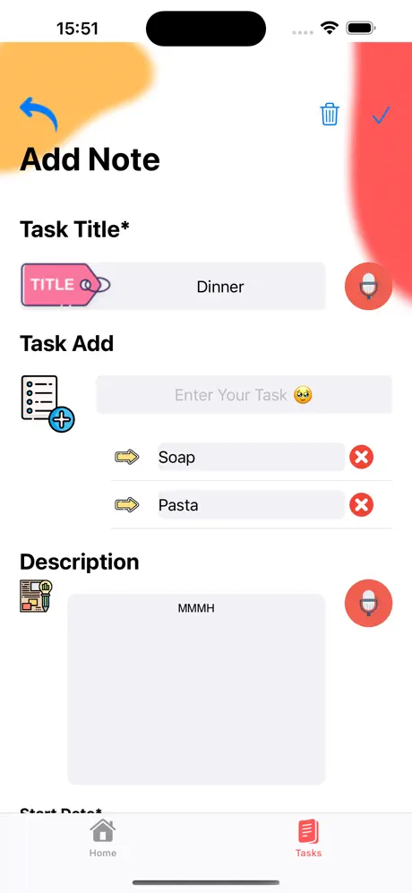

# iOS Developer Showcase

## Emir AKSU

  <table>
  <tr>
 
## Skills

- <b>Languages</b> | Swift | Delphi | C# | Python
- <b>Tools & Software</b> | Figma | Git | Firebase | App Store Connect

    </td>
  </tr>
</table>

## Projects

### Balık Avı - İstanbul Balık Avı

  
  
  
  

<table>
  <tr>
    <td valign="top" width="50%">
      
## Açıklama

- Balık Avı - İstanbul'da Balık Avı, İstanbul'da balık tutmayı sevenler için
geliştirilmiştir. Hava durumu ve su sıcaklığı gibi verileri kullanarak
balık tutma olasılığını hesaplayın, yapay zeka ile avladığınız balıkları
tanıyın ve ilerlemenizi grafiklerle takip edin.

  
    </td>
    <td valign="top" width="50%">

## Technologies Used

- 📊 Swift Charts
- 🔁 REST APIs
- 🎛️ UIKit
- 📍 CoreLocation
- 🗺️ Mapkit   
  

    </td>
  </tr>
</table>

### Baraj24

  
  
  
  

<table>
  <tr>
    <td valign="top" width="50%">
      
## Açıklama

- Gelecekte bizleri bekleyen kuraklık, su stresi gibi afetlere ne kadar hazırız?

- Günümüzde dışarı çıkarken dahi hava durumu uygulamalarını kullanıyoruz. Peki ya bizi barajlardaki kuraklık hakkında uyarabilecek bir uygulama olsaydı nasıl olurdu? İşte bu sorudan yola çıkarak bu uygulamayı geliştirdim. Türkiye üzerinde açık kaynaklardan toplayabildiğimiz baraj verilerini bu uygulama üzerinde geçmişe ve günümüze dönük olarak görüntüleyebilirsiniz.

  
    </td>
    <td valign="top" width="50%">

## Technologies Used

- 📊 Swift Charts
- 🔁 REST APIs
- 🎛️ UIKit
- 📍 CoreLocation
- 🫛 CocoaPods
- 🗺️ Mapkit   
  

    </td>
  </tr>
</table>

### TO-DO-APP

  
  
  
  

<table>
  <tr>
    <td valign="top" width="50%">
      
## Contributions

- Yapım aşamasında!                                                             

  
    </td>
    <td valign="top" width="50%">

## Technologies Used

- 🔥 Firebase
- 🎛️ UIKit
- 📖 CollectionView
- 📜 ScrollView

    </td>
  </tr>
</table>

## Deneyim

Küçük yaşlarımdan itibaren bilişim sektörüyle ilgileniyorum. Hayallerim
doğrultusunda çalışmaya bu yaşlardan itibaren başladım.

Hem yönetim hem bilişim alanında dersler görmekteyim. Python, Swift, Pascal gibi
dillere ilgileniyorum. IOS Geliştirici olma yolunda kendimi geliştirmeye çalışıyorum.
Kendi çapımda yaptığım ufak projelerimi Github hesabıma da yüklüyorum.

Yaptığım bu ufak projeler sayesinde bölüm hocalarım tarafından fark edildim ve bir
<b>TÜBİTAK</b> projesi yapmaya karar verdik. Eğitim kategorisinde Türkiye genelinde
finale kaldım ve sayısız insanla tanışma fırsatı buldum. Güncel olarak ilgilendiğim
projeler de bulunmakta

2023 Kasım ayında, Google Oyun Ve Uygulama Akademisine seçilen 2000 kişiden biri oldum. 8 ay boyunca Flutter, Unity gibi dil ve platformlar üzerine eğitimler göreceğim.

## Eğitim

- Bartın Üniversitesi | Yönetim Bilişim Sistemleri
- Andaolu Üniversitesi | Bilgisayar Programcılığı

## İletişim

Email: emiraksu1608@gmail.com

LinkedIn: https://www.linkedin.com/in/emir-aksu-118b5421b/

